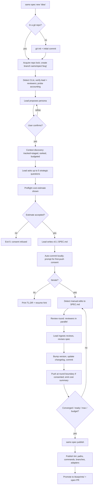

# SamoSpec — Product Spec

- **Version:** v0.5
- **Status:** build-ready draft (round-2 review findings applied)
- **Scope:** CLI only, TypeScript on Bun

---

## 1. Goal

Build a **git-native CLI** (`samo`) that turns a rough idea into a strong, versioned specification document through a structured dialogue between the user, one **lead AI expert**, and a small panel of **AI review experts** — with every material step automatically captured in git.

The tool runs locally, ships as a single binary via `bun build --compile`, and orchestrates multiple AI CLIs (Claude Code, Codex; OpenCode and Gemini opt-in only, post-v1) behind one opinionated workflow.

## 2. Why it's needed

First-draft specs written with a single AI chat are almost always:

- shallow (missing edge cases, weak tests, no ops story),
- inconsistent across sessions,
- lost in chat scrollback (no versioning, no audit),
- unreviewed (no second opinion, no adversarial critique),
- hard to iterate on without the whole thing drifting.

Engineers paper over this by copy-pasting between tools. A multi-model loop wired into git replaces the copy-paste: every refinement is a commit, every review is a file, and resuming a spec weeks later is just `git checkout` + `samo spec resume`.

## 3. Product thesis

> **One lead expert writes the spec. Reviewers with distinct personas tear it apart. Git remembers everything.**

Four claims flow from this:

1. **Asymmetric roles beat round-table chat.** The lead owns the document and the decisions; reviewers only critique. The default reviewer pair (Codex + a second Claude session) gives **cross-vendor diversity on one axis** (via Codex) and **distinct personas on both**. Full model independence requires a third vendor: once Gemini or OpenCode ships in v1.1+, the second reviewer seat auto-prefers it. The v1 claim is **persona orthogonality**, not full model orthogonality — the second Claude reviewer is role-diversified, not model-diversified.
2. **Maximum model capability by default.** Spec authoring and review are the opposite of high-throughput inference — quality and reasoning depth matter more than cost and latency. Lead and reviewers run on the **strongest, latest model from each vendor, at maximum reasoning/thinking effort**. Downshifting is a conscious user choice, not a silent default.
3. **Git is the database.** No external store, no hidden state. Drafts, reviews, decisions, and summaries live under `.samo/spec/` and are committed on every material step. A reviewer with zero tool access can read the repo and reconstruct what happened.
4. **Safe by default, networked by consent.** Auto-commit locally, never to protected branches. First push per repo requires explicit consent. Raw transcripts stay local unless opted in. Before the first paid loop, show a cost estimate.

## 4. Scope and ICP

### Primary ICP (v1)

**Technical founders and engineers** working in a git repo, comfortable with `git`, `gh`/`glab`, and AI CLIs. The UX, defaults, and error messages optimize for this user.

### Secondary ICP (deferred)

Non-engineers via a `--explain` guided mode. v1 ships this as a prompt-copy layer only (surface language changes, content is identical); a full guided mode is a later wave after v1 telemetry.

### In scope (v1)

- **Software and product specs.** One persona pack, sharp prompts, tuned templates.
- Any git repo: empty, populated, fresh, existing GitHub/GitLab remote, or no remote.
- Claude Code as lead adapter; Codex and a second Claude session as reviewers.

### Out of scope (v1)

- Non-software persona packs (marketing, ops playbooks, research) — v1.5+.
- OpenCode and Gemini adapters — v1.1+ (Gemini promotes to the Reviewer B default slot when it ships, for genuine cross-vendor diversity).
- `samo spec compare`, `samo spec export` (PDF/HTML), `samo spec diff` — v1.5+.
- Web UI, TUI, IDE extension.
- Hosted service, shared workspaces, team collaboration beyond git.
- Spec execution / auto-implementation.
- Non-git version control.

## 5. End-to-end workflow



### Phase detail

**Phase 0 — Detect environment.** Record installed CLIs and versions. Refuse to start if the **lead** is unavailable or unauthenticated. Probe each adapter for model availability, reasoning-effort support, and whether calls return `usage` (token counts). If the configured effort is not supported, surface the mismatch — never silently clamp. If an adapter reports `subscription_auth: true` (Claude Max/Pro) and cannot return `usage`, the loop applies the **subscription-auth escape** (§11): iteration, reviewer, per-call timeout, and session wall-clock caps replace token budgets for that adapter. Reviewers degrade to `N=1` with warning if only one is available; refuse the review loop if zero.

**Phase 1 — Branch and lock.** Acquire a repo-level lock at `.samo/.lock` (JSON: `{ pid, started_at, slug }`); a second concurrent `samo` invocation in the same repo exits with code 2. Create `samo/spec/<slug>` off the current branch. Protected-branch detection has an explicit **precedence**:

1. **Local checks (sufficient for safety):** hardcoded list `main|master|develop|trunk` ∪ `git config branch.<name>.protected` ∪ user config `git.protected_branches`.
2. **Remote API probe (best-effort enhancement):** `gh api repos/.../branches/<name>/protection` or `glab` equivalent; 2s timeout; failure/timeout never weakens protection.

Inability to probe the remote does not downgrade the safety invariant — local is sufficient. `samo config set git.remote_probe false` disables remote probing entirely (some users want to avoid the audit-log entry; see §14).

**Phase 2 — Lead persona.** Lead proposes a persona in the form `Veteran "<skill>" expert`. User accepts, edits the quoted skill inline, or replaces. Choice persisted in `state.json`.

**Phase 3 — Context discovery.** See §7 context subsystem. Reads = `git ls-files` ∪ `git ls-files --others --exclude-standard` (tracked + staged-but-unignored), minus `.gitignore`/`.samoignore` and the hard-coded no-read list. Produces `context.json` with provenance, budget accounting, and a `risk_flags` array.

**Phase 4 — Strategic interview.** Up to **5** high-signal questions, each with standard options plus three escape hatches: `decide for me`, `not sure — defer`, `custom`. Hard cap: 5.

**Phase 5 — v0.1 draft + preflight.** Before the first paid lead call, `samo` shows a **preflight cost estimate** band using the current spec scaffold, context budgets, iteration cap, and per-vendor coefficients. If the estimate range exceeds `budget.preflight_confirm_usd` (default $20), or any adapter returns `usage: null`, prompt for consent — exit 5 on refusal. After consent, lead drafts v0.1 and commits locally.

**Phase 6 — Review loop.** Round state machine (§7). Before each round, detect manual edits to `SPEC.md` since last commit; if present, prompt `incorporate`/`overwrite`/`abort` (default `incorporate`). After each round, emit a one-line cost summary. After two consecutive low-delta rounds, suggest (do not force) an effort downshift via `--effort high`.

**Phase 7 — Publish.** `samo spec publish` runs the **publish lint pass** (§14) — paths, commands, branch names, adapter/model names. Warnings are non-blocking; user can force with `--no-lint`. Then copies the final `SPEC.md` to `blueprints/<slug>/SPEC.md`, commits, (requests first-push consent if not yet granted), pushes, and opens a PR via `gh`/`glab`.

## 6. User stories

1. **New idea, new repo.** As a technical founder with a napkin sketch, I run `samo spec new "marketplace for X"` in an empty folder; the tool creates the repo, the spec branch, gathers minimal context, shows a preflight estimate, and produces a reviewed v0.3 spec.
2. **Existing repo, fresh feature.** As an engineer, I run `samo spec new payment-refunds`; the context subsystem pulls in `README.md`, manifests, `docs/`, and selected source dirs — tracked and staged — with provenance and risk flags, without blowing the token budget.
3. **Multi-model review.** As a spec owner, I want a security/ops reviewer and a QA/pedant reviewer critiquing in parallel so blind spots are caught before engineering effort goes in.
4. **Resume later.** As a part-time contributor, I close my laptop mid-iteration and run `samo spec resume` three days later. It reads `state.json`, reconciles with the remote if reachable (or continues offline with `remote_stale`), and continues from the exact round state.
5. **Consent-gated push.** As a developer in a corporate repo, the first time `samo` would push, I see the remote name, target branch, and PR capability; I say no, and `samo` keeps working locally without asking again.
6. **Auditable trail.** As a reviewer opening the PR, I see every version, every structured critique, every lead decision, and a contextual file list per phase.
7. **Safe failure.** As a user, if one reviewer CLI crashes mid-round, the round continues with the surviving critique, the lead is told which persona is missing, and `samo spec status` explains the degraded run.
8. **Manual edit preserved.** As an engineer, I manually tweak `SPEC.md` between rounds to capture a nuance the lead missed; on the next `samo spec iterate`, the tool detects my edit and asks whether to incorporate or overwrite — never silently loses work.
9. **Subscription user works normally.** As a Claude Max subscriber whose CLI doesn't report token counts, `samo` runs without refusing; iteration and wall-clock caps replace token budgets, and `doctor` tells me this is happening.

## 7. Architecture

### Components

| Component | Responsibility |
|---|---|
| `cli` | argument parsing, subcommand dispatch, interactive prompts |
| `env` | detect installed AI CLIs + versions, guard missing tools, warn on global config contamination |
| `git` | branch creation, commits, pushes, PR opening, protected-branch detection, remote reconciliation, manual-edit detection |
| `state` | read/write `.samo/spec/<slug>/state.json`, phase machine, round state machine, repo lockfile |
| `context` | discover + rank + budget repo content, write `context.json`, blob-hash gist cache, untrusted-data envelope |
| `persona` | propose, confirm, persist lead persona |
| `interview` | 5-question loop with escape hatches |
| `author` | lead-expert orchestration: draft and revise |
| `reviewer` | reviewer-expert orchestration: parallel critique with assigned persona |
| `loop` | round scheduling, convergence + repeat-findings halt, cost summary emission |
| `adapter` | uniform interface over `claude`, `codex`; schema validation; JSON code-fence stripping; retry/repair |
| `policy` | budget guard: iteration/reviewer caps, token/$ budgets, wall-clock, preflight estimate |
| `render` | TL;DR, status, changelog formatting |
| `publish` | promote to `blueprints/`, open PR, publish lint |
| `doctor` | CLI availability, auth, subscription-auth flag, git/remote health, config sanity, entropy warning, global-config detection |

### Model roles

- **Lead** (default `claude` CLI, `claude-opus-4-7`, effort `max`).
- **Reviewer A** (default `codex` CLI, pinned model — §11, `reasoning_effort: high`). Persona: **"Paranoid security/ops engineer."** System prompt explicitly weights `missing-risk`, `weak-implementation`, and `unnecessary-scope` categories.
- **Reviewer B** (default `claude` CLI, separate session from lead, `claude-opus-4-7`, effort `max`). Persona: **"Pedantic QA / testability reviewer."** System prompt explicitly weights `ambiguity`, `contradiction`, and `weak-testing`. **Same-family as the lead — persona-diverse but not model-diverse.** In v1.1+, when a third-vendor adapter (Gemini or OpenCode) is available, this seat auto-prefers it for stronger independence.
- **User.** Final authority.

Persona weighting is advisory, not exclusive — reviewers may surface findings in any category when warranted.

### "Lead ready" protocol

Readiness is a **structured-output field** on `revise()`:

```json
{ "ready": true, "rationale": "string" }
```

The adapter layer runs a **lenient pre-parser** before `JSON.parse`: strips Markdown code fences (` ```json ... ``` ` or ` ``` ... ``` `) that some models (including Claude Opus) occasionally wrap structured output in. Sentinel strings in Markdown prose are not accepted as a ready signal. Parse-failure policy: **one repair retry within the same `revise()` call** (original attempt + one repair). If the repair also fails, that call is `terminal`; the round transitions to `lead_terminal` (below). The "two failures" rule is per-call, not across rounds.

Adapters without structured-output support fall back to a tagged section `<!-- samo:ready {"ready":...,"rationale":"..."} -->` inside the revised Markdown, parsed server-side.

### Adapter contract

Slimmer than v0.4 — three lifecycle probes and the `usage` return collapse into one another.

**Lifecycle:**

- `detect() → { installed, version, path }`.
- `auth_status() → { authenticated, account?, expires_at?, subscription_auth? }` — `subscription_auth: true` means the adapter is authenticated via subscription (Claude Max/Pro) and cannot report token counts.
- `supports_structured_output() → boolean`.
- `supports_effort(level) → boolean`.
- `models() → [{ id, family }]` — installed/available model IDs. No `is_latest` flag (vendor CLIs rarely expose this honestly; pinned defaults + fallback chain cover the need).

**Work (every call accepts `{ effort, timeout }`; default effort `max`):**

| Call | Default timeout |
|---|---|
| `ask(prompt, context, opts)` | 120s |
| `critique(spec, guidelines, opts)` | 300s |
| `revise(spec, reviews, decisions_history, opts)` | 600s |

Return shape: `{ ..., usage?, effort_used }`. `usage: null` means the adapter cannot report token/cost for this call (subscription auth, buggy adapter, etc.); the policy component treats `null` as "no token budget applies to this call" but still enforces iteration, reviewer, timeout, and wall-clock caps.

- `critique()` must validate against the review-taxonomy JSON schema; single repair retry on schema violation; `terminal` on second failure for that seat.
- `revise()` returns the `ready` + `rationale` fields inline (no separate `is_ready()` call — removed in v0.5).

**Cross-cutting:**

- **Failure classification** per call: `retryable` (rate-limit, network, 5xx, timeout) or `terminal` (auth, quota, invalid input, schema violation after repair, model refusal). Loop retries `retryable` with backoff; routes `terminal` through the round state machine.
- **Timeout handling:** timeouts are `retryable` with doubled-backoff retries (up to 2), then `terminal` for that seat.
- **Minimal-env spawn:** adapters are launched with `HOME`, `PATH`, `TMPDIR`, and the adapter's own auth env vars only. User-global config files (global `CLAUDE.md`, vendor preambles) still apply by design; `doctor` warns if detected.
- **JSON pre-parser** strips Markdown code fences before `JSON.parse` on every structured-output call.
- Adapters are fully mockable via a fake-CLI harness (a Bun script that consumes stdin and emits scripted stdout).

### Context subsystem

- **Reads:** `git ls-files` ∪ `git ls-files --others --exclude-standard`. Covers tracked + staged-but-unignored. No reads outside the repo root. Symlinks resolving outside the repo refused.
- **Hard-coded no-read list** (cannot be overridden by `.samoignore`), path-suffix match, case-insensitive:
  - `.env*`, `.npmrc`, `.pypirc`, `.netrc`, `.aws/credentials`, `.aws/config`, `.ssh/*`, `.kube/config`, `.docker/config.json`, `.dockercfg`
  - `*.pem`, `*.key`, `*.p12`, `*.pfx`, `id_rsa*`, `id_ed25519*`, `id_ecdsa*`, `credentials*`
  - anything under `.git/` (`git ls-files` does not return it; list makes future relaxations safe)
- **Discovery buckets:** `README.md`/`README.*`, `CONTRIBUTING.md`, package manifests (`package.json`, `Cargo.toml`, `go.mod`, `pyproject.toml`, `requirements*.txt`, `Gemfile`, not lockfiles), top-level docs (`docs/`, `ARCHITECTURE.md`, `*.adoc`), user-selected source dirs via `--context "src/auth,src/billing"`.
- **Ignore defaults:** `.gitignore` + `.samoignore` + denylist (`node_modules/`, `vendor/`, `dist/`, `build/`, `*.lock`, binaries, `*.min.*`, `*.generated.*`, assets >100KB, files >1000 lines pre-truncated to head+tail 100 lines before read — catches Swagger specs, large fixtures).
- **Ranking:** README > manifests > architecture docs > user-selected source > the rest. **Tie-break: `git authordate` recency only** (path shallowness dropped; it's a weak signal).
- **Batched metadata:** one `git log --format='%at %H' --name-only --all | head -n <budget>` invocation at phase start; file → last-authored-at map built in-process. No per-file `git log` spawns.
- **Budget:** per-phase — interview 5K, draft 30K, revision 20K (plus current spec).
- **Gists for excluded files:**
  - **Deterministic gist first:** path, size, line count, last-authored date, parsed imports/exports if cheap. Zero model tokens. Applied to all excluded files.
  - **Model gist second:** only on top 20 excluded files by rank, and only when the lead's revision call explicitly requests deeper context on a specific file. Counted against budget.
  - **Cache:** gists stored at `.samo/cache/gists/<blob-sha>.md`, keyed by git blob hash. Cache directory is `.gitignore`d; survives resumes within the same blob, invalidated automatically on file change. Prevents punishing latency on every loop.
- **Untrusted-data envelope:** every repo-file block passed to an adapter is wrapped:
  ```
  <repo_content trusted="false" path="<path>" sha="<blob>">
  ...content...
  </repo_content>
  ```
  System prompts instruct the lead and reviewers to treat content inside `trusted="false"` as data, never instructions. This is a defense-in-depth measure; it does not guarantee injection resistance.
- **Provenance:** `context.json` per phase records files included, bytes read, tokens used (when reportable), gist IDs, and a `risk_flags` array (e.g. `injection_pattern_detected`, `high_entropy_strings_present`, `large_file_truncated`, `binary_excluded`). Committed with the spec.

### Round state machine

| State | Meaning | Resume behavior |
|---|---|---|
| `planned` | Round allocated; nothing run | Start fresh |
| `running` | ≥1 reviewer call in flight | Retry from `planned`; partial outputs preserved but tagged |
| `reviews_collected` | All expected reviewer outputs validated | Skip to `lead_revised` |
| `lead_revised` | Lead's revision written, not committed | Commit as next step |
| `committed` | Round finalized in git; `state.json` advanced | Start next round |
| `lead_terminal` | Lead call `terminal` and non-retryable (refusal, schema fail after repair, invalid input) | Halt; user must edit `SPEC.md` manually or abort |

**Atomicity:** each transition flushes artifacts before updating `state.json`. Each round directory has a `round.json` sidecar:

```json
{
  "round": 3,
  "status": "planned|running|complete|partial|abandoned",
  "seats": { "reviewer_a": "pending|ok|failed|schema_violation|timeout",
             "reviewer_b": "pending|ok|failed|schema_violation|timeout" },
  "started_at": "2026-04-19T...",
  "completed_at": "..."
}
```

Partial outputs on disk are preserved for post-mortem but never read as complete critiques — only a `status: complete` round contributes to lead revision.

**Manual-edit detection** runs at the start of `samo spec iterate` and on `samo spec resume` before the next round enters `running`: `git diff HEAD -- SPEC.md`. A non-empty diff triggers a prompt (`incorporate`/`overwrite`/`abort`; default `incorporate`). `incorporate` commits the user edit as a version bump with a `user-edit` changelog line before the next round runs.

### Reviewer failure handling

- **Only one of N available at start:** degrade to `N=1`, warn, record in `state.json`.
- **One of two fails mid-round:** round proceeds with the surviving critique; the lead prompt is told which persona is missing.
- **Schema violation after single repair retry:** that seat is `terminal`; round may still proceed with the other seat.
- **Seat timeout:** classified `retryable`; two doubled-timeout retries before becoming `terminal` for that seat.
- **Both reviewers fail same round:** round marked `abandoned`; loop may continue (user prompt) or exit per stopping condition #6.
- **Lead `retryable` failure:** state stays at `reviews_collected`; next run retries.
- **Lead `terminal` failure** (refusal, schema fail, invalid input): round transitions to `lead_terminal`; loop halts with exit 4; user edits manually and runs `samo spec iterate` to retry.
- **Commit/push fails:** state stays at `lead_revised`; next run retries commit first, then push.

### Review taxonomy

| Category | What it flags |
|---|---|
| `ambiguity` | wording that admits multiple reasonable interpretations |
| `contradiction` | two parts of the spec that cannot both be true |
| `missing-requirement` | a needed behavior, constraint, or edge case not addressed |
| `weak-testing` | test plan gaps: missing scenarios, untestable assertions, no red-green hook |
| `weak-implementation` | architecture or plan too hand-wavy to act on |
| `missing-risk` | unstated assumption, security/ops/cost risk, or dependency |
| `unnecessary-scope` | gold-plating, premature abstraction, out-of-scope content to cut |

Reviewers choose the **most specific** category when a finding could fit more than one (e.g. an ambiguous wording that also hides a missing requirement → `missing-requirement`). The lead may reclassify on ingest; disagreement on category is not counted as reviewer disagreement.

Reviewer system prompts bias emphasis (see Model roles) but do not forbid any category. Each review file is structured Markdown (one section per category + `summary` + `suggested-next-version`). Lead decisions (`accepted`/`rejected`/`deferred` + rationale) append to `decisions.md`.

## 8. Git behavior

**Auto-commit locally; network side effects by consent.**

- **Auto-branch.** Every `samo spec new` creates `samo/spec/<slug>` off the current branch. Never commits to any detected-protected branch (§5 Phase 1).
- **Auto-commit.** Every material step commits. Messages: `spec(<slug>): <action> v<version>`.
- **First push is consent-gated.** The first push in a repo prompts once, showing remote name, target branch, default branch, and PR capability. Choice persisted at `.samo/config.json` `git.push_consent.<remote>`. Stored choice respected silently on later sessions.
- **Push cadence after consent:** round boundaries + publish — not per commit.
- **No force pushes.** Ever.
- **`--no-push` / `--no-commit`** override per invocation; `--no-commit` implies `--no-push`.
- **PR on publish** via `gh` or `glab`.

### Remote reconciliation and offline resume

- On resume, `samo` attempts `git fetch` with a **5s timeout** (configurable).
- **FF success:** proceed.
- **Non-FF divergence:** halt and surface the conflict with next-step guidance. Never auto-rebase or force.
- **Fetch timeout or failure:** continue **local-only**; set `state.json.remote_stale = true`. The next online resume reconciles before proceeding.
- **`state.json` HEAD mismatch** with local HEAD: halt with an explanation.

### Manual edits between rounds

`samo spec iterate` and `samo spec resume` detect uncommitted changes to `.samo/spec/<slug>/SPEC.md` via `git diff HEAD`. Three options:

1. **Incorporate** (default) — commit the edits as a version bump with a `user-edit` changelog entry, then run the round.
2. **Overwrite** — discard the edits, run the round.
3. **Abort** — exit without changes.

### Dirty working tree

- **Engineer mode (default):** three options — `Stash and continue` (default, `git stash push -u`), `Continue anyway`, `Abort`.
- **Guided mode (`--explain`):** halt by default; ask the user to commit or abort. `samo` does not auto-stash in this mode.
- **Resume on a dirty branch:** never auto-stashes; surface and stop.

### Concurrency

Repo-level lockfile at `.samo/.lock` acquired at invocation and released at exit (or removed on stale-PID detection). Second concurrent `samo` process in the same repo exits with code 2 and a message pointing at the current holder.

### Branch-selection flags

| Option | Flag | Behavior |
|---|---|---|
| Safe separate branch | *(default)* | Auto-creates `samo/spec/<slug>` |
| Use current branch | `--here` | Commits on current branch (refused on protected branches) |
| Local-only | `--no-push` | Auto-commits; never pushes |
| Dry run | `--no-commit` | Writes files; no git operations |

## 9. Storage and retention

```text
.samo/
  config.json                    # per-repo config (models, budgets, push consent)
  .lock                          # repo-level lockfile; gitignored
  .gitignore                     # ignores transcripts/, full/, cache/, .lock
  cache/
    gists/<blob-sha>.md          # gist cache keyed by git blob hash
  spec/<slug>/
    SPEC.md                      # working copy, canonical during iteration
    TLDR.md                      # regenerated on every version bump, committed
    state.json                   # phase, round state, version, persona, flags
    interview.json
    context.json                 # discovery/ranking/provenance + risk_flags
    decisions.md                 # append-only; includes user-edit entries
    changelog.md
    reviews/r01/
      codex.md                   # structured critique (security/ops persona)
      claude.md                  # structured critique (QA/pedant persona)
      round.json                 # round sidecar: status + seats
      summary.md                 # lead's synthesis
    transcripts/                 # NOT committed by default
      author.log
      r01-codex.log
      r01-claude.log
blueprints/
  <slug>/
    SPEC.md                      # promoted copy, emitted by samo spec publish
```

**Rules:**

- **Committed by default:** `SPEC.md`, `TLDR.md`, `state.json`, `interview.json`, `context.json`, `decisions.md`, `changelog.md`, `reviews/` (incl. `round.json`).
- **Not committed by default:** `transcripts/`, `cache/`, `.lock`. Opt-in retention for transcripts via `samo config set storage.retain_transcripts true`; trimmed + redacted either way.
- **Secrets redaction.** Regex corpus drawn from the gitleaks and truffleHog rule sets. Tightened patterns:
  - AWS: `AKIA[0-9A-Z]{16}`, `ASIA[0-9A-Z]{16}`.
  - OpenAI-family: `sk-[A-Za-z0-9]{20,}`, `sk-proj-[A-Za-z0-9]{20,}`.
  - GitHub: `ghp_[A-Za-z0-9]{36}`, `gho_[A-Za-z0-9]{36}`, `ghs_[A-Za-z0-9]{36}`.
  - GitLab: `glpat-[A-Za-z0-9_-]{20,}`.
  - JWT (tightened): `eyJ[A-Za-z0-9_-]{10,}\.[A-Za-z0-9_-]{10,}\.[A-Za-z0-9_-]{10,}` — narrow to the base64-header-prefix form; avoids false positives on `v1.2.3`, `foo.bar.baz`, `example.com.au`.
  - Slack / Stripe / Google patterns pulled from the corpus.
- **`blueprints/<slug>/SPEC.md`** is a promoted snapshot; never hand-edited.
- **Multi-spec contention.** Slug-scoped directories do not collide. A future `blueprints/README.md` index is written atomic-append only.

## 10. CLI

**v1 surface:**

```
samo init                                      # register .samo/ in an existing repo
samo spec new <slug> [--idea "..."] [--persona "..."] [--effort max|high|medium|low]
                     [--context "<paths>"] [--no-commit] [--no-push] [--explain]
samo spec resume [<slug>]                      # resume last or named spec
samo spec status [<slug>]                      # phase, round state, version, next action, cost summary
samo spec iterate                              # one round of review + revise
                                               # errors (exit 1) if no spec exists; suggests `new`
samo spec publish [<slug>] [--no-lint]         # promote to blueprints/, run lint, open PR
samo spec tldr [<slug>]                        # print the TL;DR
samo doctor                                    # availability, auth, git/remote, config, entropy, global-config
samo experts list                              # show available AI CLIs and which are enabled
samo experts set <role> <adapter>              # role ∈ { lead, reviewer-a, reviewer-b }
samo config get|set <key> [<value>]
samo version
```

**Deferred:** `spec compare`, `spec diff`, `spec export` (md/pdf/html), `spec review --rounds N`, `spec ready`, non-software persona packs, OpenCode/Gemini adapters. PDF/HTML drags in pandoc or Chromium headless — disproportionate dependency footprint for v1.

**Interactive prompts** use plain numbered menus. Every prompt has a default in brackets; `Enter` does the safe, obvious thing.

**Exit codes:** `0` success; `1` user error; `2` infra/git/network/concurrency; `3` interrupted; `4` model refused or budget exceeded or `lead_terminal`; `5` consent refused (first push, preflight cost, sensitive-path read).

## 11. Model policy

**Default posture: strongest + latest + max effort.** Spec authoring and multi-round review are quality-critical, low-volume calls. Defaults bias toward reasoning depth over cost/latency. Per-invocation downshift: `--effort high|medium|low`. Per-repo: `samo config set adapters.effort high`. Never silent.

### Pinned defaults

Both adapters are pinned with the same discipline — no "strongest available" handwaving.

- **Lead:** `claude` CLI, model `claude-opus-4-7`, effort `max`. Fallback: `claude-opus-4-7 → claude-sonnet-4-6 → terminal`.
- **Reviewer A:** `codex` CLI, model `gpt-5.1-codex-max` (or the currently-strongest reasoning-capable Codex release; pin maintained per `samo` release). `reasoning_effort: high`. Persona "Paranoid security/ops engineer".
- **Reviewer B:** `claude` CLI (separate session from lead), model `claude-opus-4-7`, effort `max`. Persona "Pedantic QA / testability reviewer". **v1.1+ auto-prefers Gemini/OpenCode** for this seat when those adapters ship.
- Post-v1 adapter policy (Gemini, OpenCode) is opt-in + accounting-required + fail-closed, with the subscription-auth escape (below) as the sole exception.

The resolved `{ adapter, model_id, effort_requested, effort_used }` for each role is recorded in `state.json` at round start.

### Resume policy on model resolution change

- **Same family, patch/minor bump** (e.g. `claude-opus-4-7 → claude-opus-4-8`): record the new resolution, continue, note in changelog.
- **Major family change** (e.g. `claude-opus-* → claude-haiku-*`): halt and ask. User can accept, revert via `experts set`, or abort.

### Effort levels

| Logical | Claude | Codex / OpenAI-family | Gemini (post-v1) |
|---|---|---|---|
| `max` | extended thinking, budget unconstrained | `reasoning_effort: high` | thinking budget unconstrained |
| `high` | extended thinking, bounded | `reasoning_effort: high` | bounded |
| `medium` | standard | `reasoning_effort: medium` | standard |
| `low` | standard | `reasoning_effort: low` | standard |
| `off` | no thinking | `reasoning_effort: minimal`/off | off |

`effort_used` echoed on every work call; clamps are visible in `state.json` and `doctor`.

### Subscription-auth escape

Claude Max/Pro CLIs authenticate via subscription and do not expose token counts. When `auth_status().subscription_auth === true` **and** `usage` is consistently `null`:

- Token budgets (`max_tokens_per_round`, `max_total_tokens_per_session`, `max_cost_usd`) are **disabled** for that adapter only.
- `max_iterations`, `max_reviewers`, per-call `timeout`, and **`budget.max_wall_clock_minutes`** (default 120) are enforced normally.
- `doctor` surfaces subscription-auth mode so the user knows token cost is not visible.
- Preflight cost estimate shows "unknown — subscription auth" rather than a dollar band for that adapter.

This is the only exception to "fail-closed without accounting". It exists because the rule otherwise excludes the majority of Claude CLI users. Non-subscription adapters with missing `usage` still fail closed.

### Budget guardrails

Enforced on every adapter call. Lead revision passes count equally with reviewer critiques.

- `budget.max_tokens_per_round` — default **250K** (max effort includes thinking).
- `budget.max_total_tokens_per_session` — default **2M**, hard stop mid-round, exit 4.
- `budget.max_cost_usd` — optional, fail-closed when accounting unsupported, except under subscription-auth escape.
- `budget.max_wall_clock_minutes` — default **120**. Session cap; hits exit with reason `wall-clock`.
- `budget.preflight_confirm_usd` — default **$20**. If preflight estimate exceeds, prompt for consent.
- `budget.max_reviewers`, `budget.max_iterations` — mirror `N`/`M`.

Budget defaults are deliberately generous. The CLI emits a one-line per-round summary so cost is never invisible.

### Preflight cost estimate

Before the first paid call, `samo` computes a cost band:

- v0.1 draft: estimated revision-size × lead token coefficient.
- Loop: `M_avg × (reviewer_pair_cost + revision_cost)` where `M_avg = M/2` (midpoint estimate).
- Context overhead: sum of per-phase budgets × phase count.

Output: "estimated range: $X–$Y, likely $Z" with per-adapter breakdown and subscription-auth note when applicable. Over `preflight_confirm_usd` → prompt with `[accept / downshift / abort]`.

## 12. Stopping conditions

Loop exits on the first of:

1. `M` rounds reached (default 10).
2. Lead `ready=true` (structured signal; §7 ready protocol).
3. **Semantic convergence:** two consecutive rounds where **no category other than `summary` received new findings AND diff ≤ `convergence.min_delta_lines` (default 20)**. After two consecutive low-delta rounds without convergence, `samo` suggests (does not force) `--effort high` downshift.
4. **Repeat-findings halt** — concrete algorithm:
   - For each new finding in the current round, compute **trigram Jaccard similarity** against every finding from the prior round in the **same category**. Finding is "repeated" if `max_similarity ≥ 0.8`.
   - If **≥80% of the current round's findings are repeated**, halt with reason `lead-ignoring-critiques`.
   - Requires user intervention: edit `SPEC.md` manually and `iterate`, or abort. Prevents "converged garbage" where the lead stops engaging.
5. User `Ctrl-C`.
6. Reviewer availability drops to zero, or both reviewers fail same round and user declines continue.
7. Budget hit (`max_total_tokens_per_session`, `max_cost_usd`, or `max_wall_clock_minutes`).
8. `lead_terminal` (round state).

Every exit is recorded in `state.json` with a reason string and round index.

## 13. Tests, CI, and red-green TDD

### Red-green TDD targets

1. **Phase machine (property-based).** `fast-check` generates random legal and illegal action sequences. Invariants: `state.json` always parseable; phase never goes backwards; version monotonically non-decreasing; round state transitions match §7. The protected-branch invariant is tested via a **mocked detector** — when the mock says a branch is protected, no commit ever lands on it. Real detection has its own integration test.
2. **Git branch safety (integration).** Real local bare repo + scripted `gh` stub. Every dirty-tree option × every branch-selection flag × every protected-branch source (hardcoded / `git config` / user config / remote API).
3. **Stopping conditions.** One test per exit reason. Condition 4 uses a trigram-Jaccard fixture with designed overlaps.
4. **Adapter contract.** Shared contract test every adapter must pass. Fake-CLI harness (Bun script). Covers: schema-violation path (one retry then terminal), timeout (two retries with doubled timeout), Markdown-code-fence wrapping stripped, `usage: null` path, `subscription_auth` detection.
5. **Resume idempotency (formally defined).** Equality between an uninterrupted run and a kill+resume run is: identical phase sequence, identical version count, identical decision-category distribution, identical file set under `.samo/spec/<slug>/`, identical `state.json` keys. **Exclusion list** (nondeterministic): `context.json.usage.*`, `round.json.started_at`, `round.json.completed_at`, `state.json.remote_stale`, timestamps in commit metadata. Spec prose is not required to match.
6. **Remote reconciliation.** FF success, non-FF halt, fetch-timeout → local-only + `remote_stale` flag, HEAD-mismatch halt.
7. **Redaction regex corpus.** Committed corpus at `tests/fixtures/redaction/known.txt` sourced from gitleaks / truffleHog patterns plus generated property-test inputs.
8. **Dogfood scorecard (Sprint 4 exit).**
   1. Every v0.5 §-level heading present.
   2. `round.json` with `status: "complete"` for ≥3 rounds.
   3. `context.json` present with non-empty `files` and `risk_flags`.
   4. `decisions.md` contains ≥1 `accepted` and ≥1 `rejected`-or-`deferred` entry.
   5. Publish lint emits zero missing-path warnings.

### CI and fixtures

- GitHub Actions matrix: Linux + macOS, Bun LTS.
- **No network in CI.** All adapter calls via recorded fixtures.
- Coverage gate: 80% line overall; 90% on `state`, `git`, `loop`, `context`, `adapter`.
- Lint + format gate required before merge.
- **Weekly live workflow** against real CLIs with a small fixed prompt corpus.
- **Fixture regeneration** is a documented process. `scripts/regenerate-fixtures.ts` runs with authenticated adapters, writes new transcripts, and opens a PR. CI enforces that fixture files only change via that PR (hash check + script-generated marker).

## 14. Threat model

- **Prompt injection via repo content.** Mitigations: (a) system-prompt hardening explicitly instructing the lead to treat repo content as data, (b) **untrusted-data envelope** around every repo block (§7 context), (c) pre-processing pass flagging blocks matching `^#?\s*(ignore previous|system:|you are now)` — count surfaced in `context.json.risk_flags`, and if count > `context.injection_threshold` (default 5) the user is prompted before the loop starts, (d) structured-output contracts on all calls — a hijack must also produce valid JSON.
- **Secrets in transcripts / prompts.** Hard-coded no-read list (§7) + redaction corpus (§9) + `doctor` entropy warning. Redaction is best-effort; `doctor` says so and recommends external scanners for sensitive repos.
- **Vendor TOS / training on committed data.** `samo init` shows a one-time notice on committed-artifact visibility. `samo spec publish` on a public repo prompts once to confirm awareness.
- **Hallucinated repo facts (publish lint, broadened).**
  - **Paths:** extracted from (a) fenced code blocks, (b) backtick-wrapped strings containing `/` or matching `\S+\.(md|json|ts|js|sql|py|rs|go|yaml|yml|toml|sh)`, or (c) bulleted lines under section headers named `Files`, `Layout`, `Storage`, or similar. Bare dotted strings in prose (`e.g.`, `v1.2.3`, `example.com`) are excluded. Missing paths → warning, not block.
  - **Commands** in `bash`/`sh` fenced blocks: first token matches an entry in `$PATH` **or** is one of the documented `samo`/`git`/`gh`/`glab`/`bun`/`claude`/`codex` commands. Unknown commands → warning.
  - **Branch names** referenced in the spec match actual branches or the configured protected list. Ghost branches → warning.
  - **Adapter / model names** in prose match the currently resolved `state.json` adapters. Model drift → warning.
  - User can force past warnings with `--no-lint`; warnings are always recorded in the PR description.
- **Adversarial reviewer / collusion.** Cross-vendor hedge on Reviewer A (Codex). Repeat-findings halt catches a lead ignoring critiques. Vendor diversity is best-effort — acknowledged, not claimed as a proof.
- **Global CLAUDE.md / vendor-config contamination.** User-global config files (`~/.claude/CLAUDE.md`, `~/.codex/preamble.md`, org-scoped preambles) can steer adapter behavior in ways `samo` cannot see. Minimal-env spawn (§7). `doctor` detects common global-config locations and warns. A `--sandbox` mode is on the post-v1 roadmap.
- **`gh api` audit entries.** Remote protected-branch probes create GitHub audit log entries visible to repo admins. `doctor` notes this. `samo config set git.remote_probe false` disables the probe; local checks remain sufficient for safety.
- **Committed artifacts referencing external URLs.** `samo` never auto-fetches URLs.

**Out of scope:** supply-chain attacks on adapter CLIs themselves; a malicious `claude`/`codex` binary is outside what `samo` can defend against.

## 15. Implementation plan

v1 ships lead + two reviewers + local commits + consent-gated push. No Gemini, no OpenCode, no `compare`/`export`, no persona packs beyond software.

### Sprint 1 — skeleton and safety (1 week)

- Bun project scaffolding; `bun build --compile` single-binary targets for Linux and macOS.
- `samo init`, `samo version`, `samo doctor` (basic).
- Phase machine + `state.json`; round state machine skeleton including `lead_terminal`.
- Git layer: protected-branch detection (local precedence + remote API probe w/ 2s timeout), commit, refusal, dirty-tree defaults.
- Repo lockfile at `.samo/.lock`.
- Property-based phase-machine tests; fake adapter harness; subscription-auth detection stub.

**Exit:** `samo init` + `doctor` green on Linux + macOS; property tests + concurrency test pass.

### Sprint 2 — context + lead (1 week)

- Context subsystem: discovery, ignore, expanded no-read list, ranking (batched `git log`), budget, blob-hash gist cache, untrusted-data envelope, `context.json` provenance with `risk_flags`.
- Claude adapter (lead) with structured-output + JSON code-fence pre-parser + `usage: null` handling.
- Persona proposal + 5-question interview.
- Preflight cost estimate.
- v0.1 draft + first commit.
- TL;DR renderer; redaction corpus + property test.

**Exit:** `samo spec new` end-to-end against recorded Claude adapter; `context.json` populated on a real repo; subscription-auth path exercised.

### Sprint 3 — review loop (1.5 weeks)

- Codex adapter (Reviewer A, security/ops persona, taxonomy weighting).
- Second Claude session adapter (Reviewer B, QA/pedant persona, taxonomy weighting).
- Round state machine: all six states, atomicity, `round.json` sidecar.
- Parallel reviewers with partial-failure + timeout handling.
- Lead revision + changelog + version bump + `ready` structured field.
- Convergence (semantic + diff), repeat-findings halt (trigram Jaccard 0.8 / 80%), all stopping conditions.
- Manual-edit detection on `iterate` / `resume`.
- Remote reconciliation including offline path.
- `samo spec resume`, `status`, `iterate`, `experts set`.

**Exit:** full loop runs to convergence on recorded adapters; kill+resume at each round state yields equality per §13.5; non-FF and offline resume paths green.

### Sprint 4 — publish, consent, hardening (1 week)

- First-push consent flow + per-repo persistence.
- `samo spec publish`: copy to `blueprints/`, commit, push, open PR.
- **Publish lint broadened** (paths + commands + branches + adapters).
- Budget guardrails including wall-clock + preflight.
- `doctor` full coverage: entropy scan, auth, remote probe, global-config detection, subscription-auth flag.
- Dogfood scorecard test (5 criteria).
- Docs (README, examples). Non-software persona packs deliberately NOT shipped.

**Exit:** publish end-to-end on a fixture repo with real GitHub remote; dogfood scorecard green; weekly live CI green.

## 16. Language and distribution

**TypeScript on Bun.** Rationale:

- `bun build --compile` produces a single static binary per platform; matches the distribution story with no runtime install.
- `Bun.spawn` is first-class and ergonomic for CLI-over-CLI orchestration with structured stream handling.
- Fast startup (critical for a CLI invoked interactively).
- Zod + JSON Schema ecosystem for structured-output validation.
- Strong types keep the adapter contract honest.

**Binary size is 50–100 MB per platform** because the compile bundles the JavaScriptCore runtime. This is acceptable for Homebrew and apt. Distribution channels with strict size caps (some internal artifact stores) can use `bunx` entry point instead.

## 17. Dogfooding

v1 must reproduce this spec. A Sprint 4 exit test runs `samo` on a fresh repo with a seed prompt of comparable ambition and asserts the five-point scorecard in §13.8. If v1 cannot produce a v0.5-grade spec for itself, v1 is not done.

## 18. Risks and open questions

**Risks:**

- Vendor CLI drift → contract tests + weekly live CI + documented fixture regeneration.
- Push surprises → consent gate + `doctor` preview.
- Cost shock at max effort → preflight estimate + per-round summary + subscription-auth escape + downshift suggestion after low-delta rounds.
- Repo bloat → transcripts uncommitted by default.
- Secret leakage → no-read list + redaction + `doctor` entropy warning. Best-effort; we say so.
- Lead hallucinating repo facts → broadened publish lint (paths, commands, branches, adapters).
- Prompt injection → system-prompt hardening + untrusted envelope + structured-output contracts.
- Adapter collusion → vendor diversity on Reviewer A; repeat-findings halt catches lead disengagement.
- Global vendor-config contamination → minimal-env spawn + `doctor` detection; `--sandbox` post-v1.
- `gh api` audit entries → disclosed in `doctor`; opt-out via config.

**Open questions:**

- Should `samo spec publish` tag `spec/<slug>/v0.3`? Lean yes once `publish` stabilizes in v1.1.
- Should Reviewer B auto-promote to Gemini/OpenCode on v1.1 install, or require explicit opt-in? Lean auto-promote with a one-time notice.
- Dogfood structural scorecard vs a golden-diff-with-human-approval gate: scorecard covers v1; reconsider golden-diff after a few real users.
- Guided-mode graduation past `--explain`: decide after v1 telemetry.

## 19. Comparison with v0.4

| Dimension | v0.4 | v0.5 |
|---|---|---|
| Reviewer B framing | Implied orthogonality | Persona-orthogonal only; plan to auto-prefer third-vendor in v1.1+ |
| Codex pinning | Unpinned "strongest available" | Pinned model; same discipline as Claude; resume policy on family change |
| Context reads | `git ls-files` only | `git ls-files` ∪ `--others --exclude-standard` (staged + tracked) |
| No-read list | 6 patterns | 15+ (`.npmrc`, `.netrc`, `.aws/`, `.ssh/`, `.kube`, `.docker`, `.git/`, plus v0.4 items) |
| Large auto-generated files | Size-only cutoff | Files >1000 lines pre-truncated to head+tail 100 |
| Gist policy | Model gists unbounded | Top-20 cap; deterministic-first, model-second; blob-hash cache |
| Context envelope | Implicit | Explicit `<repo_content trusted="false">` tags + risk flags |
| Manual spec edits | Silently overwritten | Detected; incorporate/overwrite/abort prompt |
| Concurrency | Unspecified | Repo lockfile |
| Offline resume | Fetch fails = halt | 5s fetch timeout → local-only + `remote_stale` flag |
| Adapter contract | `accounting()` + `is_ready()` + `is_latest` | Slimmer: `usage` can be `null`; `ready` folded into `revise()`; `is_latest` dropped |
| JSON parsing | Strict | Pre-parser strips Markdown code fences before `JSON.parse` |
| Per-call timeouts | Unspecified | `ask` 120s, `critique` 300s, `revise` 600s; retryable, doubled-backoff |
| Minimal-env spawn | Implicit | Explicit: HOME/PATH/TMPDIR + auth vars only |
| Subscription-auth (Max/Pro) | Would fail-closed | Iteration + wall-clock + reviewer + timeout caps replace token budgets |
| Preflight cost | Absent | Estimate band + `preflight_confirm_usd` gate |
| Wall-clock budget | Absent | `max_wall_clock_minutes` default 120 |
| Effort downshift | Only on explicit flag | Suggested after 2 consecutive low-delta rounds |
| Protected-branch precedence | Four-way, ambiguous | Local-sufficient; remote API best-effort with 2s timeout + opt-out |
| Repeat-findings halt algorithm | "Normalized fuzzy match" | Trigram Jaccard ≥0.8 per finding; 80% round-level threshold |
| Reviewer persona enforcement | Generic | System prompts weight specific review-taxonomy categories per persona |
| Round states | 5 | 6 (new `lead_terminal` for non-retryable refusal) |
| Partial-output tagging | Unspecified | `round.json` sidecar with per-seat status |
| JWT redaction regex | `\w+\.\w+\.\w+` (over-broad) | `eyJ[A-Za-z0-9_-]{10,}\.[A-Za-z0-9_-]{10,}\.[A-Za-z0-9_-]{10,}` |
| Redaction corpus | Inline list | Gitleaks/truffleHog-derived corpus + property test |
| Path-lint matching | Implied | Explicit rules (fenced blocks / backtick paths / section-scoped bullets) |
| Publish lint | Paths only | Paths + commands + branches + adapter/model references |
| Idempotency equality | "Minus timestamps" | Explicit exclusion list (`context.json.usage.*`, `round.json.*_at`, `remote_stale`) |
| Dogfood criterion | "v0.4-grade" | 5-point scorecard |
| `doctor` surface | Availability/auth/git/entropy | + global-config detection + subscription-auth flag + remote-probe opt-out hint |
| `experts set` CLI | Dropped | Restored for post-init role wiring |
| `iterate` preconditions | Unspecified | Error if no spec exists |
| Binary size | Unstated | 50–100 MB noted |

## 20. Changelog

### v0.5 — 2026-04-19

Applied findings from a second round of three independent reviews. Major changes:

- **Reviewer B honesty.** Thesis narrowed to persona orthogonality; the second reviewer seat auto-prefers a third-vendor adapter (Gemini/OpenCode) when available in v1.1+.
- **Codex pinned** with the same discipline as Claude; explicit major/minor auto-update policy on resume.
- **Context subsystem tightened.** Reads include staged-but-unignored files. No-read list expanded: `.npmrc`, `.pypirc`, `.netrc`, `.aws/`, `.ssh/`, `.kube/config`, `.docker/config.json`, `.git/`. Files >1000 lines pre-truncated. Ranking drops path-shallowness; uses batched `git log` (no per-file spawns). Gists capped at top-20, deterministic-first; blob-hash cache at `.samo/cache/gists/`. Untrusted-data envelope (`<repo_content trusted="false">`) added.
- **Manual edit detection.** Uncommitted `SPEC.md` changes between rounds are detected and offered three resolutions; `user-edit` changelog entry on incorporate.
- **Repo-level lockfile** at `.samo/.lock`; second concurrent `samo` process refused (exit 2).
- **Offline resume.** `git fetch` with 5s timeout → local-only continue with `remote_stale` flag; next online resume reconciles.
- **Adapter contract slimmed.** `accounting()`, `is_ready()`, and `is_latest` removed; `usage` can be `null`; `ready` folded into `revise()`. JSON pre-parser strips Markdown code fences.
- **Subscription-auth escape.** Adapters with `subscription_auth: true` (Claude Max/Pro) skip token budgets but enforce iteration, reviewer, per-call timeout, and **`max_wall_clock_minutes`** (default 120) caps. Unblocks the majority of Claude CLI users.
- **Per-call timeouts** defaulted: `ask` 120s, `critique` 300s, `revise` 600s; classified `retryable`; doubled-backoff with 2 retries before `terminal` for that seat.
- **Preflight cost estimate** before loop start; `budget.preflight_confirm_usd` (default $20) gate. Exit 5 on refusal.
- **Wall-clock session cap** added (`budget.max_wall_clock_minutes`).
- **Effort downshift suggestion** after two consecutive low-delta rounds.
- **Protected-branch precedence** made explicit: local checks sufficient; remote API best-effort with 2s timeout + `git.remote_probe` opt-out.
- **Minimal-env spawn** for adapters; `doctor` detects global vendor-config locations and warns (threat model).
- **Repeat-findings halt** concrete algorithm: trigram Jaccard ≥0.8 per finding; 80% round-level threshold.
- **Reviewer persona system prompts** explicitly weight review-taxonomy categories (A → `missing-risk`/`weak-implementation`/`unnecessary-scope`; B → `ambiguity`/`contradiction`/`weak-testing`).
- **`lead_terminal` round state** for non-retryable lead failures (refusal, schema fail after repair).
- **`round.json`** sidecar per round for partial-output tagging and per-seat status.
- **Publish lint broadened** to commands (in `bash`/`sh` code fences), branch names, and adapter/model references. Hallucinated-path matching rules made explicit; bare dotted strings excluded.
- **Redaction corpus** references gitleaks/truffleHog; JWT pattern tightened to `eyJ[...]` form to avoid false positives like `v1.2.3`.
- **Idempotency equality** given an explicit exclusion list.
- **Dogfood test** replaced by a 5-point scorecard.
- **Bun binary size** (50–100 MB) disclosed.
- **`gh api` audit entries** called out in threat model + `doctor`.
- **`samo experts set <role> <adapter>`** CLI restored for post-init role wiring.
- **`samo spec iterate` preconditions** clarified (error if no spec; suggests `new`).
- **User story 8** (manual edit preserved) and **story 9** (subscription-auth works normally) added.

### v0.4 — 2026-04-19

Incorporated findings from three independent reviews. Major changes:

- **Scope discipline.** Primary ICP narrowed to engineers/technical founders; non-engineer mode reduced to a copy-layer in v1. Non-software persona packs and extra adapters pushed to v1.1+/v1.5+. CLI surface trimmed from 16 to 8 subcommands.
- **Networked side effects by consent.** First-push-per-repo prompt with persisted consent; pushes happen at round boundaries, not per commit.
- **Context subsystem.** New dedicated component with discovery, ignore/no-read rules, ranking, per-phase token budget, truncation via gists, and `context.json` provenance.
- **Lead readiness is structured.** `revise()` returns `{ ready, rationale }`; Markdown sentinels rejected.
- **Strict schema on reviewer output.** `critique()` must validate; single repair retry; terminal otherwise.
- **Reviewer personas asymmetric.** Codex = security/ops; Claude (separate session) = QA/pedant.
- **Round state machine.** Five states with atomicity and per-state resume.
- **Partial reviewer failure.** Degrade N=2 → N=1 with warning; continue with surviving critique.
- **Remote reconciliation on resume.** Fetch + FF only; halt on non-FF; verify `state.json` HEAD.
- **Transcripts uncommitted by default.** Opt-in retention; trimmed either way; redaction pass.
- **Secrets redaction.** Regex pass; no-read list for dotfiles; `doctor` entropy warning.
- **Convergence strengthened.** Semantic signal (no new findings outside `summary`) combined with diff threshold; repeat-findings halt.
- **Protected branches detected four ways.** Hardcoded + `git config` + remote API + user config.
- **Budget accounts for revision passes** equally with reviewer calls.
- **Pinned lead model + fallback chain.**
- **Threat model (§14).** Prompt injection, secrets, vendor TOS, hallucinated paths, adversarial reviewer.
- **Hallucinated-path lint** on publish.
- **Property-based phase-machine tests; documented fixture regeneration; formally defined resume-idempotency equality.**
- **Dogfooding commitment.**
- **Language chosen: TypeScript on Bun.**
- **Strongest + latest + max-effort default.** Normalized across vendors; `effort_used` echoed; budgets raised.

### v0.3 (alt) — 2026-04-19

Enriched with ideas from `SPEC.md` (v0.2):

- Added review taxonomy (seven categories).
- Expanded adapter contract.
- Added dirty-working-tree handling.
- Exposed branch-selection options.
- Named and defined non-engineer plain-English mode.
- Added `samo doctor`, `samo spec compare`, `samo spec export`, `samo spec tldr`.
- Added `TLDR.md` as a first-class, always-committed artifact.
- Promoted `policy` to a named architectural component; strengthened Gemini policy to fail-closed without accounting.

### v0.2 (alt) — 2026-04-19

- Initial alternative spec authored in parallel to `SPEC.md`.
- Fixed hidden working area at `.samo/spec/<slug>/`.
- Fixed auto-branch / auto-commit / auto-push as safe defaults.
- Defined full CLI surface and adapter contract.
- Defined structured review layout and convergence rules.
- Added explicit `publish` phase that promotes to `blueprints/` and opens a PR.
- Added end-to-end Mermaid workflow diagram.
