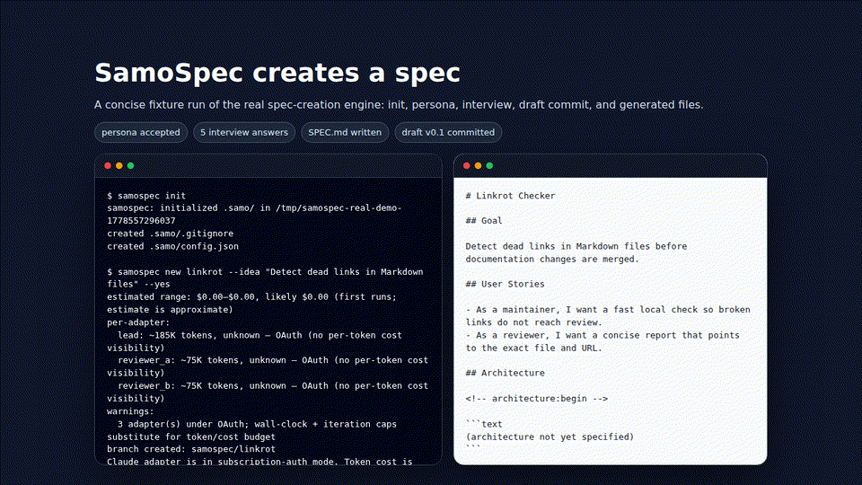

# SamoSpec

[](https://github.com/NikolayS/samospec/actions/workflows/ci.yml)
[](https://www.npmjs.com/package/samospec)
[](LICENSE)
[](https://bun.sh)

> Turn a rough idea into a **reviewed, versioned spec** — with every round captured in git, not chat scrollback.

`samospec` is a git-native CLI that runs a small panel of top AI models against your idea: a **lead** drafts, two **reviewers** critique with different personas, the lead revises, and the loop repeats until convergence. The result is `SPEC.md` with real commit history — `v0.1 → v0.2 → … → v1.0` — that you can diff, blame, and publish.



**Live demo** — a real spec produced end-to-end over ChatGPT-account OAuth:
→ https://github.com/NikolayS/todo-stream/tree/samospec/todo-stream
(browse the `.samo/spec/todo-stream/` tree; 7 review rounds, both reviewers writing real critiques)

---

## Why

Most "AI writes my spec" tools give you one shot from one model. You get a monologue in a chat window, lose the context the moment the tab closes, and have no record of what was considered and rejected.

SamoSpec treats spec authoring like code review:

- **Panel, not monologue.** One lead drafts; two reviewers with deliberately different personas critique in parallel. Disagreement is surfaced, not averaged away.
- **Every round is a commit.** Each revision lives on a `samospec/<slug>` branch. `git log` tells the story. `decisions.md` records what was accepted, rejected, or deferred — and why.
- **Convergence is defined, not vibes.** Eight explicit stopping conditions — lead-ready, semantic convergence, repeat-findings halt via trigram Jaccard, wall-clock cap, budget cap, max rounds, reviewers-exhausted, user SIGINT — mean the loop _ends_ on its own.
- **Strongest model, deep reasoning by default.** Every seat runs the top of each vendor's ladder at effort `high` out of the box; `--effort max` dials it to the deepest review and lower levels trade depth for speed. The level is an explicit knob, never a silent downshift. The thesis is that great specs come from the strongest models running deep, not from the cheapest model running often.

---

## Run

No install step. Requires [Bun](https://bun.sh) ≥ 1.2.0; `bunx` fetches and caches `samospec` on first use.

```bash
bunx samospec doctor
bunx samospec --version   # 0.9.1
```

`npx` won't work — the CLI ships as TypeScript and depends on the Bun runtime (`Bun.spawn`, etc.). Use `bunx`.

For brevity, the rest of this README writes `samospec` — read it as `bunx samospec`.

> **Running samospec from a bot / agent / CI?** See
> [`docs/bot-operations.md`](docs/bot-operations.md) — a self-contained
> runbook with the credential checklist, the fully non-interactive command
> surface, exit codes, stopping conditions, and the JSONL interview protocol.

---

## Quickstart

Three commands, from idea to reviewed spec:

```bash
bunx samospec init                                       # scaffolds .samo/ in the current git repo
bunx samospec new linkrot --idea "Detect dead links in Markdown files"
bunx samospec iterate linkrot                            # lead drafts → 2 reviewers critique → lead revises → repeat
bunx samospec publish linkrot                            # promote, commit, push, open PR via gh
```

At every step: `bunx samospec status <slug>` prints phase, current version, next-step hint, and last-round summary.

---

## How it works

```text
                 ┌────────────────────┐
   idea  ──►     │  LEAD  (Claude)    │  ──►   SPEC.md v0.N
                 │  draft / revise    │
                 └────┬───────────────┘
                      │  (parallel)
       ┌──────────────┴──────────────┐
       ▼                             ▼
 ┌──────────────┐             ┌──────────────┐
 │ Reviewer A   │             │ Reviewer B   │
 │ (Codex)      │             │ (Claude #2)  │
 │ security/ops │             │ QA/pedant    │
 └──────┬───────┘             └───────┬──────┘
        │                             │
        └───────┐             ┌───────┘
                ▼             ▼
             ┌──────────────────────┐
             │  round.json          │  ─► commit ─► repeat
             │  claude.md, codex.md │
             │  decisions.md update │
             └──────────────────────┘
```

- **Lead** = `claude` CLI, pinned `claude-opus-4-8` (fallback chain `claude-opus-4-8 → claude-opus-4-7 → claude-sonnet-4-6`), default effort `high`.
- **Reviewer A** = `codex` CLI with a **security/ops** persona: missing risks, weak implementation, unnecessary scope. Pinned `gpt-5.5` (fallback `gpt-5.5 → gpt-5.4 → gpt-5.3-codex → account-default`).
- **Reviewer B** = second `claude` session with a **QA / testability** persona: ambiguity, contradiction, weak-testing. Same pin as the lead (`claude-opus-4-8`). Also checks the spec's mandatory baseline sections and verifies it stays faithful to your original idea.
- Adapters share a coupled-fallback rule (lead and Reviewer B use the same vendor, so a Claude outage fails them together rather than running an uneven panel).

Every generated `SPEC.md` gets nine mandatory sections by default (goal & why, user stories, architecture, implementation details, tests plan with red/green TDD, team of veteran experts, sprint plan, embedded changelog, version header). Pass `--skip` to opt out.

Every spec also ships a machine-readable `.samo/spec/<slug>/architecture.json` (Zod-validated; nodes/edges/groups/notes) and an auto-rendered 80-column ASCII diagram embedded in SPEC.md between `<!-- architecture:begin -->` / `<!-- architecture:end -->` sentinels. `iterate` re-renders the block from `architecture.json` on every round, so the diagram stays in lockstep with the schema.

---

## Auth — OAuth is the happy path

The CLI shells out to the vendor CLIs you already use. OAuth-based sessions are the **primary** auth mode — API keys are an alternative:

- **Claude Code** — `claude /login` once in a terminal; samospec inherits the session for `claude --print` calls. Or set the `ANTHROPIC_API_KEY` env var. **Requires `claude` ≥ v2.1.0** (samospec passes `--effort` on every call; older CLIs reject the flag). `samospec doctor` WARNs if your `claude` predates it.
- **Codex** — `codex auth` (ChatGPT subscription account works); samospec handles the pinned-model fallback when your account default differs. Or set the `OPENAI_API_KEY` env var. Note: here Codex is a full reviewer LLM, so its `OPENAI_API_KEY` (when used) drives chat/reasoning calls — distinct from images-only OpenAI usage elsewhere in the Samo stack.

A stale `ANTHROPIC_API_KEY` in the environment **preempts** the `claude /login` OAuth session and surfaces as an `Invalid API key` WARN in `doctor` — `unset` it to fall back to OAuth. Same shape for Codex.

```bash
samospec doctor   # availability, effort-support, auth, git, lock, config,
                  # global-config, entropy, push-consent, calibration, pr-capability
```

> **Bots:** the full credential/setup checklist (every env-var name, the
> `claude -p` OAuth-subprocess model, doctor exit codes) is in
> [`docs/bot-operations.md`](docs/bot-operations.md).

---

## Safety model

- **Never commits to protected branches.** The publish PR targets `main` from a `samospec/<slug>` branch.
- **First-push consent.** `samospec iterate` asks once per remote before pushing; decision persists in `.samo/config.json`.
- **Prompt-injection envelope.** Untrusted content (repo files, review bodies) is wrapped in a content-unique `<repo_content_<sha8> trusted="false">…</repo_content_<sha8>>` frame with a recency-bias suffix reminder, so a hostile README can't hijack the lead.
- **Hard-coded no-read list** for credential files (`.env*`, `~/.aws/credentials`, `~/.ssh/id_*`, …) cannot be overridden.
- **Transcripts not committed by default.** When opted in, they pass a gitleaks/truffleHog-derived redaction pass first.
- **Minimal-env spawn.** Subprocesses see only `HOME`, `PATH`, `TMPDIR`, `USER`, `LOGNAME` plus caller-declared auth vars — no ambient environment bleed.

---

## Commands

| Command                          | What it does                                                                                                                                 |
| -------------------------------- | -------------------------------------------------------------------------------------------------------------------------------------------- |
| `samospec init`                  | Scaffolds `.samo/` in the current git repo. Idempotent.                                                                                      |
| `samospec doctor`                | Checks CLI availability, auth, git, lockfile, config, entropy, calibration, push consent, global-vendor-config contamination, PR-capability. |
| `samospec new <slug> --idea "…"` | Starts a new spec: persona selection → five-question strategic interview → drafts v0.1.                                                      |
| `samospec iterate <slug>`        | Runs review rounds (lead + two reviewers in parallel) until a stopping condition fires.                                                      |
| `samospec resume <slug>`         | Idempotent resume from any crash/kill. Works at every round state boundary.                                                                  |
| `samospec status <slug>`         | Phase, version, round index, last-round summary, next-step hint.                                                                             |
| `samospec publish <slug>`        | Promotes the spec to `blueprints/<slug>/SPEC.md`, commits, pushes, opens PR via `gh` / `glab`.                                               |
| `samospec brief <slug>`          | Generates a summarized HTML brief — a derivative of the published spec, NOT the spec itself. Pages-friendly, single self-contained file.     |

Useful flags (run `samospec` with no command for the full usage block, which is the authoritative source):

- `samospec new --effort <max|high|medium|low|off>` — unified reasoning effort for ALL seats. Default `high`; `max` is deepest/slowest, `off` is minimal/fastest. Overrides per-seat config. Precedence: `--effort` flag > `adapters.<seat>.effort` in config > `high`. Same flag exists on `iterate`.
- `samospec new --skip user-stories,sprint-plan,…` — opt out of baseline sections.
- `samospec new --verbose` — emit per-phase / per-file diagnostics on stderr (stdout stays concise).
- `samospec new --max-session-wall-clock-ms <ms>` — **deprecated no-op.** The session wall-clock kill was removed; the flag is still accepted for script back-compat but the value is ignored. The only stop signals are the inactivity heartbeat and SIGTERM.
- `samospec new --force` — archive any existing `<slug>` dir as `.archived-YYYY-MM-DDThhmmssZ/` before starting.
- `samospec new --idea-file <path>` — read the idea from a file instead of `--idea "…"`. Preferred for long, structured ideas (AI agents, CI): no fragile shell-quoting. Surrounding whitespace is trimmed; internal markdown is preserved. Mutually exclusive with `--idea`.
- `samospec new --yes` — fully non-interactive: auto-accept the lead's persona proposal and default every interview answer to `decide for me`. Pair with `--answers-file <path>` when you want to steer the five questions from JSON instead.
- `samospec new --interview-protocol jsonl` — drive the interview over stdin/stdout with a line-delimited JSON event stream. The CLI emits one JSON object per line on stdout (`{"type":"persona-proposal","v":1,…}`, `{"type":"question","v":1,…}`, terminal `{"type":"complete","v":1}`); the consumer writes `{"type":"persona-answer","v":1,…}` and `{"type":"answer","v":1,…}` on stdin. Every event carries `v: 1` — the protocol version — so consumers can sniff breaking changes; events missing or mismatching `v` are rejected. Human notices route to stderr so stdout stays protocol-clean. Bypasses the `#114` non-TTY refusal (when both `--yes` and `--interview-protocol jsonl` are passed, the JSONL resolver wins; `--yes` auto-accept is ignored). Question count is bounded by the lead's output (0..5), not a fixed wire-level contract. See [`tests/cli/new-interview-protocol-jsonl.test.ts`](tests/cli/new-interview-protocol-jsonl.test.ts) for a live example (including the spawn-based end-to-end driver).
- `samospec iterate --rounds 5` — cap rounds for this invocation (a safety **cap**, not a target; the loop usually stops earlier on a convergence condition).
- `samospec iterate --no-push` — stay local this run.
- `samospec iterate --remote <name>` — git remote name (default: `origin`). Also on `publish`.
- `samospec iterate --quiet` — suppress the per-round progress + heartbeat stream on stderr (final summary still prints on stdout). `--verbose` is a no-op alias (iterate is verbose by default).
- `samospec iterate --on-dirty <incorporate|overwrite|abort>` — non-interactive answer for the uncommitted-edits prompt. Required when stdin is not a TTY and the slug dir has dirty edits.
- `samospec iterate --push-consent <yes|no>` — non-interactive answer for the first-push consent prompt. Required (or `--no-push`, or `--yes`) when stdin is not a TTY and the remote has no persisted consent.
- `samospec iterate --yes` — accept everything non-interactively; implies `--push-consent yes`.
- `samospec publish --no-lint` — skip the publish-time lint pass.
- `samospec brief <slug> --out docs/<slug>/index.html` — write the brief into your static-site host's expected location instead of the default `blueprints/<slug>/BRIEF.html`.
- `samospec brief <slug> --no-nojekyll` — skip creating the repo-root `.nojekyll` marker (default: created idempotently for GitHub Pages compatibility).
- `samospec brief <slug> --ai` — generate a **rich** HTML brief via the lead AI adapter with a cross-vendor verifier pass. Produces SVG architecture diagrams (synthesized from `architecture.json`), scope tables, decision matrices, mobile-responsive layout (per [Thariq's "unreasonable effectiveness of HTML"](https://x.com/trq212/status/2052809885763747935)). Cached in `.samo/cache/brief/` keyed by spec hash; re-runs return the cached HTML for free.
- `samospec brief <slug> --ai --no-cache` — force a fresh AI generation even when a cache hit exists.
- `samospec brief <slug> --ai --no-verify` — skip the verifier pass. Faster but the brief may contain claims that don't trace back to `SPEC.md`.

---

## Where files live

samospec follows the shared Samo repository layout:

- `samo/` contains visible, reviewable project artifacts: specs, blueprints, briefs, tool descriptions, and scenario/policy documents.
- `.samo/` contains machine config, cache, locks, runtime state, and local/generated artifacts that should not be treated as the product source of truth.

samospec keeps two kinds of artifacts in your repo:

- **Working drafts** — read/written every round. Target default: `samo/spec/<slug>/`.
  - `SPEC.md` (canonical during iteration), `TLDR.md`, `state.json`, `interview.json`, `context.json`, `decisions.md`, `changelog.md`, `architecture.json`, `reviews/r01/`, `transcripts/` (gitignored).
- **Published snapshots** — promoted by `samospec publish`. Target default: `samo/blueprints/<slug>/`.
  - `SPEC.md` (immutable promoted copy), and after `samospec brief <slug>`, `BRIEF.html` (summarized derivative).

Hidden runtime / config:

- `.samo/config.json` — per-repo config (push consent, calibration, lint allowlist, paths overrides). Committed.
- `.samo/.lock`, `.samo/cache/`, `.samo/transcripts/` — runtime, gitignored.

### Configuring paths

Both root-level paths are configurable via `.samo/config.json` so you can host briefs and blueprints wherever your static-site setup expects them (GitHub Pages root, GitHub Pages `/docs`, GitLab Pages `public/`, etc.):

```json
{
  "schema_version": 1,
  "paths": {
    "spec_dir": "samo/spec",
    "blueprints_dir": "samo/blueprints"
  }
}
```

- `paths.spec_dir` — where working drafts live. Current default: `.samo/spec`; target default: `samo/spec`.
- `paths.blueprints_dir` — where published snapshots and briefs live. Current default: `blueprints`; target default: `samo/blueprints`.

Both must be **repo-relative** (absolute paths and `..`-escapes are rejected). Paths under `.samo/` work but GitHub Pages defaults to Jekyll, which excludes dotfile-prefixed paths — `samospec brief` writes a `.nojekyll` marker at the repo root for that reason.

> **Heads-up:** the next minor release flips the defaults to `samo/spec` and `samo/blueprints` (visible, Pages-friendly out of the box). Set the keys above to keep the legacy layout when that lands. `.samo/config.json` itself stays put — the `.samo/` directory remains the home for runtime/config files.

---

## Stack

- **Language:** TypeScript on Bun
- **Distribution:** npm (Homebrew / apt / standalone binaries — v1.1+)
- **Subprocess:** `Bun.spawn` (minimal env; AbortController-backed stream reader so SIGKILL actually unblocks)
- **Schema validation:** Zod for every structured-output contract
- **Tests:** Bun's built-in runner; `fast-check` for property-based tests on the phase + round state machines

---

## Not in this release (deferred)

- Homebrew, apt, or standalone compiled binaries — planned for v1.1+.
- Gemini and OpenCode adapters — planned for v1.1+. Claude + Codex only today.
- `samospec compare`, `samospec diff`, `samospec export pdf|html` — v1.5+.
- Non-software persona packs (marketing, ops playbooks, research specs) — v1.5+.
- `samospec experts set` — edit `.samo/config.json` manually until v1.1.

See [`.samo/blueprints/SPEC.md`](.samo/blueprints/SPEC.md) for the full product spec (architecture, state machines, adapter contract, publish lint, dogfood scorecard, threat model, implementation plan).

---

## Contributing

- PRs welcome; target `main` from a feature branch.
- Red-green TDD for new code — failing test → minimum green → refactor. Property-based tests for anything touching the phase machine, round state machine, or adapter contract.
- Conventional Commits, 50-char subjects, present tense. Never amend, never force-push without confirmation.
- See [`CLAUDE.md`](CLAUDE.md) for full engineering standards.

Found a bug? https://github.com/NikolayS/samospec/issues

---

## License

Apache-2.0. See [`LICENSE`](LICENSE). Copyright 2026 Nikolay Samokhvalov.
