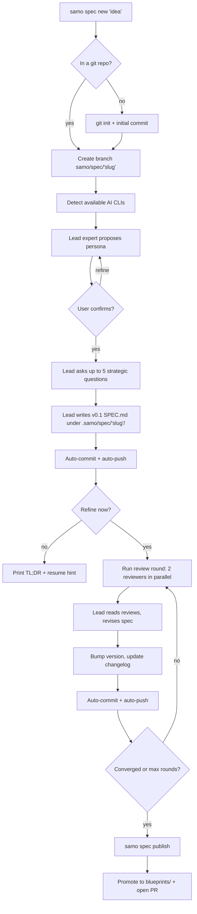

# SamoSpec — Alternative Product Spec

**Version:** v0.2 (alt)
**Status:** candidate spec, parallel to `SPEC.md`
**Scope:** CLI only

---

## 1. Goal

Build a **git-native CLI** that turns a rough idea into a strong, versioned specification document through a structured dialogue between the user, one **lead AI expert**, and a small panel of **AI review experts** — with every material step automatically captured in git.

The tool is called `samo`. It works in any git repository (or creates one), runs locally, and orchestrates multiple AI CLIs (Claude Code, Codex, optionally OpenCode, optionally Gemini) behind a single, opinionated workflow.

## 2. Why it's needed

First-draft specs written with a single AI chat are almost always:

- shallow (missing edge cases, weak tests, no ops story),
- inconsistent across sessions,
- lost in chat scrollback (no versioning, no audit),
- unreviewed (no second opinion, no adversarial critique),
- hard to iterate on without the whole thing drifting.

Engineers paper over this by copy-pasting between tools. Non-engineers simply can't. A multi-model loop wired into git solves both: every refinement is a commit, every review is a file, and resuming a spec weeks later is just `git checkout` + `samo spec resume`.

## 3. Product thesis

> **One lead expert writes the spec. Two reviewers tear it apart. Git remembers everything.**

Three claims flow from this:

1. **Asymmetric roles beat round-table chat.** The lead model owns the document and the decisions; reviewers only critique. This prevents model-averaging mush and keeps the spec coherent.
2. **Git is the database.** No external store, no hidden state. Drafts, reviews, decisions, and transcripts all live under `.samo/spec/` and are committed on every material step. A reviewer with zero tool access can read the repo and understand what happened.
3. **Safe defaults over configurability.** Auto-commit, auto-push, auto-branch, two reviewers, ten iterations max, Gemini off. A non-engineer should be able to run `samo spec new "my idea"` in any repo and not break anything.

## 4. Scope

### In scope (day one)

- Software and product specs (primary use case — tuned prompts, sharper templates).
- Broader domains: marketing plans, operational playbooks, research proposals, org design — same pipeline, different lead-expert persona.
- Any git repo: empty, populated, fresh, existing GitHub/GitLab remote, or no remote at all.
- Claude Code and Codex as first-class adapters. OpenCode optional. Gemini opt-in only.

### Out of scope (for v0.2)

- Web UI, TUI, VS Code extension.
- Hosted service, shared workspaces, team collaboration beyond git.
- Spec execution / auto-implementation.
- Non-git version control.

## 5. End-to-end workflow



### Phase detail

**Phase 0 — Detect environment.** `samo` checks for installed CLIs (`claude`, `codex`, `opencode`, `gemini`), records versions, and refuses to start if the lead model is unavailable. Gemini is hidden unless the user opts in via `samo config models.gemini enable`.

**Phase 1 — Branch and lock.** Every new spec starts on a fresh branch `samo/spec/<slug>`. If the user runs `samo` on `main`/`master`, the tool creates the branch and switches to it — it never commits to the default branch by default. A `.samo/spec/<slug>/state.json` file records the current phase so subsequent runs can resume cleanly.

**Phase 2 — Lead persona.** The lead model proposes a persona in the form `Veteran "<skill>" expert` (e.g. `Veteran "CLI software engineer" expert`). User can accept, edit the quoted skill inline, or replace entirely. Choice is written to `state.json` and reused on resume.

**Phase 3 — Strategic interview.** Up to **5** high-signal questions, each with standard options plus three universal escape hatches: `decide for me`, `not sure — defer`, and `custom`. Fewer questions are fine; more are not allowed — this is an opinionated limit that forces the lead to prioritize.

**Phase 4 — v0.1 draft.** Lead writes the full spec to `.samo/spec/<slug>/SPEC.md`. Includes: goal, user stories, architecture, CLI/API surface, tests/TDD plan, sprint plan, changelog. Immediately committed and pushed.

**Phase 5 — Review loop.** Default `N=2` reviewers (Claude + Codex), max `M=10` rounds. Each round runs reviewers in parallel, collects structured critiques into `.samo/spec/<slug>/reviews/rNN/`, the lead ingests them, revises the spec, bumps the version (`v0.2`, `v0.3`, ...), updates the changelog, and commits. Loop exits on: max rounds, lead declaring ready, two consecutive low-delta rounds, or user `Ctrl-C`.

**Phase 6 — Publish.** `samo spec publish` copies the final `SPEC.md` to `blueprints/<slug>/SPEC.md` (the visible, canonical location), commits, pushes, and — if a remote is configured — opens a PR from the branch to the default branch. The hidden working area stays intact for audit and future iteration.

## 6. User stories

1. **New idea, no repo.** As a founder with a napkin sketch, I run `samo spec new "marketplace for X"` in an empty folder and get a git repo, a spec branch, and a reviewed v0.3 spec — without knowing what a branch is.
2. **Existing repo, fresh feature.** As an engineer, I run `samo spec new "payment-refunds"` in my project; the tool reads `README.md` and key source files as context so the spec reflects real constraints.
3. **Multi-model review.** As a spec owner, I want two independent AI reviewers to critique a draft so blind spots are caught before I burn eng time implementing the wrong thing.
4. **Resume later.** As a part-time contributor, I close my laptop mid-iteration and run `samo spec resume` three days later. It reads `state.json`, checks out the branch, and continues where I stopped.
5. **Non-software spec.** As an ops lead, I run `samo spec new "incident response playbook" --persona "incident commander"` and get a real playbook, not a code design doc.
6. **Auditable trail.** As a reviewer, I open the PR and see: every version, every reviewer's critique, every lead response. I don't need the tool to read the history.
7. **Safe failure.** As a user, if a reviewer CLI crashes mid-round, the round is marked failed in git, the spec is not silently degraded, and `samo spec status` tells me what happened.

## 7. Architecture

### Components

| Component | Responsibility |
|---|---|
| `cli` | argument parsing, subcommand dispatch, interactive prompts |
| `env` | detect installed AI CLIs + versions, guard missing tools |
| `git` | branch creation, commits, pushes, PR opening (via `gh`/`glab`) |
| `state` | read/write `.samo/spec/<slug>/state.json`, phase machine |
| `persona` | propose, confirm, persist lead persona |
| `interview` | ask up to 5 questions, normalize answers |
| `author` | lead-expert orchestration: draft and revise |
| `reviewer` | reviewer-expert orchestration: parallel critique |
| `loop` | review-round scheduling, convergence detection |
| `adapter` | uniform interface over `claude`, `codex`, `opencode`, `gemini` |
| `render` | TL;DR, status, changelog formatting |
| `publish` | promote to `blueprints/`, open PR |

### Model roles

- **Lead model** (default: Claude Code). Writes, revises, and decides. Holds the spec. Resolves reviewer conflicts by judgment, not voting.
- **Review models** (default: Claude + Codex). Critique only. Cannot edit the spec. Produce a structured review file per round.
- **User.** Final authority. Can interrupt, edit manually, override persona, force publish.

### Adapter contract

Each adapter exposes three operations: `ask(prompt, context) → text`, `critique(spec, guidelines) → review`, `revise(spec, reviews) → spec`. Adapters are thin shells over the vendor CLI and are mocked in tests.

## 8. Git behavior and branch strategy

**Defaults are aggressive and safe.** Designed for a user who does not know git.

- **Auto-branch.** Every `samo spec new` creates `samo/spec/<slug>` off the current branch. Never commits to `main`/`master`/`develop`/`trunk`.
- **Auto-commit.** Every material step commits. Commit messages follow a fixed grammar: `spec(<slug>): <action> v<version>` — e.g. `spec(refunds): draft v0.1`, `spec(refunds): refine v0.3 after review r2`.
- **Auto-push.** If a remote is configured and the user is authenticated, push after each commit. If not, stay local silently — do not prompt repeatedly.
- **No force pushes.** Ever. Conflicts become new commits.
- **Resume-safe.** If the branch already exists, reattach rather than fail.
- **Dry run.** `--no-commit` flag disables auto-commit/push for the whole invocation, for experimentation.
- **PR on publish.** `samo spec publish` opens a PR via `gh` or `glab` if available; otherwise prints the compare URL.

**Why this is safe for non-engineers:** the user's existing work on `main` is never touched. The worst-case outcome is an orphan branch they can delete. The best case is a clean PR they can merge or ignore.

## 9. Storage layout

Working artifacts are hidden under `.samo/spec/`. The promoted spec lives under `blueprints/`.

```text
.samo/
  config.json                     # per-repo config (models, budgets, persona history)
  spec/
    <slug>/
      SPEC.md                     # working copy of the spec (canonical during iteration)
      state.json                  # phase, version, persona, iteration count
      interview.json              # questions + answers
      decisions.md                # append-only log of lead decisions
      changelog.md                # version history, mirrored into SPEC.md §Changelog
      transcripts/
        author.log                # lead model raw I/O (truncated)
        r01-claude.log
        r01-codex.log
      reviews/
        r01/
          claude.md               # structured critique
          codex.md
          summary.md              # lead's synthesis of this round
        r02/
          ...
blueprints/
  <slug>/
    SPEC.md                       # promoted copy, emitted by `samo spec publish`
```

**Rules.**

- `.samo/spec/<slug>/SPEC.md` is the source of truth during iteration.
- `blueprints/<slug>/SPEC.md` is a promoted snapshot; never hand-edited.
- Transcripts are trimmed (first + last N tokens) to keep the repo small; full logs can be opted in via config.
- Everything under `.samo/spec/` is committed. Nothing is gitignored by default — the audit trail is the point.

## 10. CLI UX

```
samo init                              # register .samo/ in an existing repo
samo spec new <slug> [--persona "..."] [--idea "..."] [--no-commit]
samo spec resume [<slug>]              # resume last or named spec
samo spec status [<slug>]              # phase, version, round count, next action
samo spec review [--rounds N]          # run N review rounds now
samo spec iterate                      # one round of review + revise
samo spec ready                        # mark spec as ready, stop auto-refinement
samo spec publish [<slug>]             # promote to blueprints/, open PR
samo spec diff [<version>]             # show diff vs a prior version
samo experts list                      # show available AI CLIs and which are enabled
samo experts set lead claude           # set lead model
samo experts set reviewers claude,codex
samo config get|set <key> [<value>]    # read/write .samo/config.json
samo version
```

**Interactive prompts** use plain numbered menus, never multi-key shortcuts. Every prompt has a default bracketed in the prompt (`[Y/n]`, `[1]`). A single `Enter` always does the safe, obvious thing.

**Exit codes.** `0` success; `1` user-facing error (bad args, missing CLI); `2` infrastructure error (git/network); `3` interrupted; `4` model refused or budget exceeded.

## 11. Model policy

- **Lead default:** Claude Code with the strongest available model.
- **Reviewers default:** Claude + Codex (N=2, M=10).
- **OpenCode:** available if installed, not enabled by default.
- **Gemini:** hidden until `samo config set models.gemini.enabled true`. Requires explicit per-invocation confirmation for the first three uses.
- **Budget guardrails:** optional `budget.max_tokens_per_round` and `budget.max_total_tokens`. Exceeding either stops the loop with exit code 4 and a clear message.
- **Tool availability detection:** run once per invocation; cached in `.samo/config.json`.

## 12. Stopping conditions for the review loop

The loop exits on the first of:

1. `M` rounds reached (default 10).
2. Lead declares the spec ready (explicit signal in its revision output).
3. Two consecutive rounds with diff size below a threshold (`convergence.min_delta_lines`, default 20).
4. User interrupts (`Ctrl-C`) or runs `samo spec ready`.
5. Reviewer failure rate exceeds threshold (e.g. both reviewers fail in the same round).

Every exit is recorded in `state.json` with a reason string.

## 13. Tests, CI, and red-green TDD

### Red-green TDD plan

The codebase is built test-first. Every feature lands as: failing test → minimum green → refactor. Specific red-first targets:

1. **Phase machine.** Write a state-transition test suite before any phase code. Every legal and illegal transition is a test case.
2. **Git branch safety.** Before implementing git logic, write a test that asserts `samo spec new` on `main` never leaves a commit on `main`.
3. **Stopping conditions.** One test per stopping condition, using a mocked adapter that emits scripted responses.
4. **Adapter contract.** A shared contract test that every adapter implementation must pass, using a fake CLI binary.
5. **Resume idempotency.** Run `samo spec new` → kill mid-phase → `samo spec resume`; assert final state equals unkilled run.

### Test categories

| Category | What it covers |
|---|---|
| Unit | phase machine, convergence math, persona parsing, changelog bumping |
| Integration | git branch/commit/push against a real local bare repo, with mocked adapters |
| Contract | adapter conformance using a fake CLI harness |
| End-to-end | full `samo spec new → publish` against a fixture repo, recorded-response adapters |
| Regression | a corpus of known-good spec inputs with golden outputs (diffed, not exact-matched) |

### CI

- GitHub Actions matrix: Linux + macOS, two language toolchain versions.
- No network in CI: all model calls go through mocked adapters with recorded fixtures.
- Coverage gate: 80% line, 90% on `state`, `git`, `loop`.
- Lint + format gate required before merge.
- A separate opt-in "live" workflow runs weekly against real CLIs with small fixed prompts to catch adapter drift.

## 14. Implementation plan

### Sprint 1 — skeleton and safety (1 week)

- Language and build toolchain chosen; repo scaffolded.
- `samo init`, `samo version`, `samo experts list`.
- Phase machine + `state.json` read/write.
- Git layer: branch creation, commit, push, refusal to commit to protected branches.
- Red-green test harness with a fake adapter.

**Exit criteria:** `samo init` in any repo produces `.samo/config.json`; unit + integration tests green.

### Sprint 2 — lead authoring (1 week)

- Adapter for Claude Code.
- Persona proposal + confirmation.
- 5-question interview with escape hatches.
- v0.1 spec authoring and first auto-commit/push.
- TL;DR renderer.

**Exit criteria:** `samo spec new` end-to-end against a fixture repo with a recorded Claude adapter.

### Sprint 3 — review loop (1–2 weeks)

- Codex adapter.
- Parallel review orchestration, structured review files.
- Lead revision pass with changelog + version bump.
- Convergence + stopping conditions.
- `samo spec resume`, `samo spec status`, `samo spec iterate`.

**Exit criteria:** full loop runs to convergence against recorded adapters; `samo spec status` reflects every phase.

### Sprint 4 — publish and polish (1 week)

- `samo spec publish`: promote to `blueprints/`, open PR via `gh`/`glab`.
- `samo spec diff`, `samo spec ready`.
- OpenCode adapter (optional path).
- Gemini adapter behind opt-in flag.
- Budget guardrails.
- Docs, examples, non-software persona pack.

**Exit criteria:** published PR on a public fixture repo; weekly live CI green.

### Parallelization notes

- Adapter work (Sprint 2–4) runs parallel to git/state work (Sprint 1–3) once the adapter contract is frozen.
- Renderers and CLI-UX polish run parallel to loop logic in Sprint 3.
- Non-software persona prompts can be developed without touching core code.

## 15. Risks and open questions

**Risks.**

- **Vendor CLI drift.** Upstream tools change output formats. Mitigation: adapter contract tests + weekly live CI.
- **Auto-push surprises.** A user runs `samo` in a repo with sensitive remotes. Mitigation: detect protected branches, never push to them; first-run prompt shows target remote and allows opt-out.
- **Repo bloat from transcripts.** Mitigation: trim by default, gitignored overflow under `.samo/spec/<slug>/transcripts/full/` if opted in.
- **Model collusion.** Two reviewers from the same vendor agree on bad critiques. Mitigation: default reviewer pair crosses vendors (Claude + Codex).

**Open questions.**

- Language choice: Go vs Rust vs Node. Leaning Go for single-binary distribution and fast startup.
- Should `samo spec publish` also tag (`spec/<slug>/v0.3`)? Probably yes in v0.3.
- Should we support multiple active specs per repo in parallel? Yes structurally (slug-scoped), but UX needs work.
- How to surface cost estimates pre-loop. Not in v0.2 — revisit once budget guardrails ship.

## 16. Comparison with `SPEC.md` (v0.1)

| Dimension | SPEC.md (v0.1) | SPEC-alt.md (v0.2) |
|---|---|---|
| Working storage | `blueprints/<feature>/` | `.samo/spec/<slug>/` (hidden), `blueprints/` only on publish |
| Branch strategy | Not specified | Auto-branch `samo/spec/<slug>`, never commits to default branch |
| Push behavior | Not specified | Auto-push by default; safe defaults for non-engineers |
| Review artifacts | Mentioned | Required in git; structured per-round layout |
| CLI UX | Not specified | Full subcommand surface defined |
| Publish step | Not specified | Explicit `publish` with PR open |
| Scope | Software-primary, broader secondary | Broad from day one; software is the primary *tuning*, not the boundary |
| Reviewer default | 2 | 2 (kept) |

## 17. Changelog

### v0.2 (alt) — 2026-04-19

- Initial alternative spec authored in parallel to `SPEC.md`.
- Fixed hidden working area at `.samo/spec/<slug>/`.
- Fixed auto-branch / auto-commit / auto-push as safe defaults.
- Defined full CLI surface and adapter contract.
- Defined structured review layout and convergence rules.
- Added explicit `publish` phase that promotes to `blueprints/` and opens a PR.
- Added end-to-end Mermaid workflow diagram.
- Broadened scope to non-software specs from day one via persona packs.
